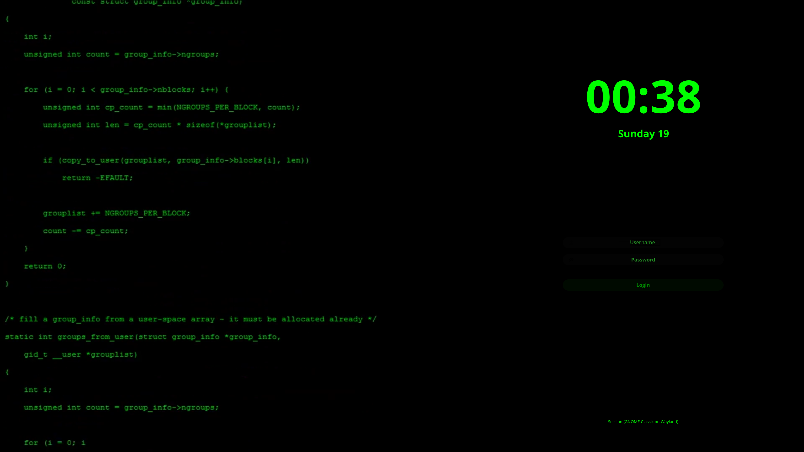

# sddm-hacker-theme

[sddm-hacker-theme](https://github.com/ColonialKreeper/sddm-hacker-theme) is a series of themes for the [SDDM](https://github.com/sddm/sddm/) display manager made by **[ColonialKreeper](https://github.com/ColonialKreeper/) forked from [sddm-astronaut-theme](https://github.com/Keyitdev/sddm-astronaut-theme) by [Keyitdev](https://github.com/Keyitdev)**.

It's written using the latest version of Qt, which is **Qt6**. Its key features include **virtual keyboard support** and an **installation script**. This theme also support **animated wallpapers**. You can easily change its appearance by choosing another of the ten pre-made themes or creating your own. Each of these themes was created by modifying just one file - **[config](./Themes/astronaut.conf)**.

All themes were created for 1080p. However, they should work well in other resolutions.

# Preview



# Installation


### Automatic Installation

```sh
sh -c "$(curl -fsSL https://raw.githubusercontent.com/ColonialKreeper/sddm-hacker-theme/master/setup.sh)"
```
> Works on distributions using pacman, xbps-install, dnf, zypper and maybe apt?.   
> Remember to always read the scripts you run from the internet.


### Manual Installation

1. Install **dependencies**

[`sddm >= 0.21.0`](https://github.com/sddm/sddm), [`qt6 >= 6.8`](https://doc.qt.io/qt-6/index.html), [`qt6-svg >= 6.8`](https://doc.qt.io/qt-6/qtsvg-index.html), [`qt6-virtualkeyboard >= 6.8`](https://doc.qt.io/qt-6/qtvirtualkeyboard-index.html), [`qt6-multimedia >= 6.8`](https://doc.qt.io/qt-6/qtmultimedia-index.html)

You may also want to install additional video codecs like h.264.

```sh
sddm qt6-svg qt6-virtualkeyboard qt6-multimedia-ffmpeg     # Arch
sddm qt6-svg qt6-virtualkeyboard qt6-multimedia            # Void
sddm qt6-qtsvg qt6-qtvirtualkeyboard qt6-qtmultimedia      # Fedora
sddm-qt6 libQt6Svg6 qt6-virtualkeyboard qt6-virtualkeyboard-imports qt6-multimedia qt6-multimedia-imports        # OpenSUSE
sddm libqt6svg6 qt6-virtualkeyboard-plugin libqt6multimedia6 qml6-module-qtquick-controls qml6-module-qtquick-effects libxcb-cursor0 # Debian Unstable
```

2. Clone this repository
```sh
sudo git clone -b master --depth 1 https://github.com/ColonialKreeper/sddm-hacker-theme.git /usr/share/sddm/themes/sddm-hacker-theme
```
3. Copy fonts to `/usr/share/fonts/`
```sh
sudo cp -r /usr/share/sddm/themes/sddm-hacker-theme/Fonts/* /usr/share/fonts/
```
4. Edit `/etc/sddm.conf`
```sh
echo "[Theme]
Current=sddm-hacker-theme" | sudo tee /etc/sddm.conf
```
5. Edit `/etc/sddm.conf.d/virtualkbd.conf`
```sh
echo "[General]
InputMethod=qtvirtualkeyboard" | sudo tee /etc/sddm.conf.d/virtualkbd.conf
```

## Previewing a theme

You can preview the set theme without logging out by runnning:
```sh
sddm-greeter-qt6 --test-mode --theme /usr/share/sddm/themes/sddm-hacker-theme/
```
> Note that depending on the system configuration, the preview may differ slightly from the actual login screen.

## Sources

Initially the theme was independed fork of [MarianArlt's theme](https://github.com/MarianArlt/sddm-sugar-dark) but now the project has come a long way and started to significantly deviate from the original.
Many of the wallpapers and fonts used in this project are very popular and copied from one user to another, so I don't know who the original creator is. I have copied the qt code and config from 
sddm-astronaut-theme and modifed it. Here are links to some of the orginal artist who created this wonderful wallpaper:

- Hacker: [wallpaper](https://motionbgs.com/hacker-typer), [font](https://fonts.google.com/specimen/Open+Sans/about)

If I have made any attribution errors I apologize.

